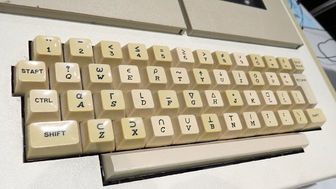

# How do I type these characters?!?!?!?

Step 1: go to Amazon and buy a special APL typewriter keyboard...

Just kidding (thankfully).
In the modern day and age, there are way better options:

---

### Simplest: Press the buttons in the IDE

At the top of the TryAPL page (and this course page) there are symbols you can click.
You can also hover over them to get a quick overview of what each symbol does in APL.

This is, however, quite slow when you need to write APL code *fast*.
Find some alternatives below.

---

### Quickest: Use keyboard shortcuts

On TryAPL (and this page), you can use prefixes to insert various special symbols.

You can use any of the following keys as prefixes:
<kbd>`</kbd> <kbd>§</kbd> <kbd>°</kbd> <kbd>²</kbd> <kbd>µ</kbd> <kbd>º</kbd> <kbd>½</kbd> <kbd>ù</kbd>

On Finnish keyboards, the <kbd>§</kbd> key (located to the left of <kbd>1</kbd>) is the easiest to use.
On US and UK keyboards, the <kbd>`</kbd> key is preferred.
Whichever key you pick we will denote as <kbd>PREFIX</kbd> from now on.

To use prefixes, hit whatever prefix key you are using, followed by the key you want to type.
For example, the multiplication symbol `×` is inserted by typing <kbd>PREFIX</kbd> <kbd>-</kbd>
and division `÷` is inserted with <kbd>PREFIX</kbd> <kbd>=</kbd>.

While these might seem unintuitive at first, you'll get used to them fairly quickly.
You can see the completion shortcut if you hover over the symbol in the top language bar.
For example, hovering over `×` shows that you can type it by using `<prefix> -`, just like we did above. 

---

### Quickest (alternative): Tab completion

Sometimes, if you have a Finnish keyboard, you will be unable to type certain prefix shortcuts that were designed for US keyboards.
Thankfully, there is an alternative: tab completions.
You can find the keys needed for tab completion in the same tooltip that shows you what keys to use for the prefix shortcuts.

For example, hovering over the arrow symbol (`←`) shows the follwing information: `< - <tab>`.
Just follow the instructions and hit the keys <kbd><</kbd> <kbd>-</kbd> ++tab++.
You'll notice that the alternative, <kbd>PREFIX</kbd> <kbd>[</kbd> is impossible to type on a Finnish keyboard,
as it doesn't have a separate <kbd>[</kbd> key (and using <kbd>AltGr</kbd> breaks the APL shortcut).

!!! bug "Note!"

    Tab completion is only required for non-US users due to a ~~bug~~ feature in TryAPL,
    which is that it's designed with only US keyboards in mind.

    When we install the Dyalog IDE in a future chapter, this will no longer be a concern, as that supports Finnish
    (and various other non-US) keyboards natively.

