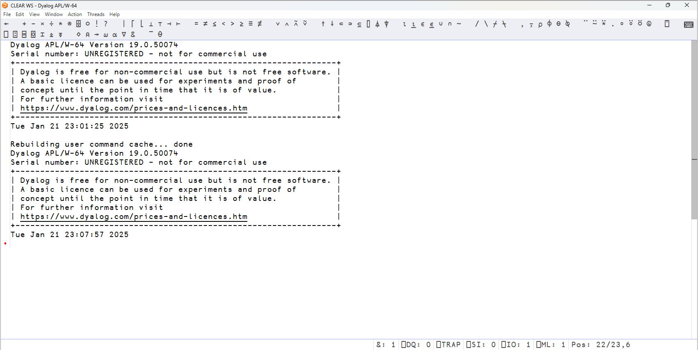

# Installing Dyalog

!!! abstract "This part will cover"
    
    - Setting up Dyalog APL on your computer
    - Installing Dyalog RIDE

---

We promised in the beginning of the course that you would get to learn APL: A Programming Language.
Now, we finally get to the "Programming" part!
In this chapter, we'll get you set up to write larger programs that can actually do real-world stuff.
First, however, we have to install the right tools.

Our goal is to install Dyalog and RIDE.
Dyalog is the software that implements APL, while RIDE is an IDE that gives you a nice-looking interface to edit and run APL code.
By the end of the tutorial, you will be able to open RIDE, which looks something like this:



!!! tip "Choose your warrior"

    This part is split up into different sections based on your operating system.
    Choose the one that you're using:

    - Ubuntu / Debian
    - Nix / NixOS
    - Windows

---

## Ubuntu / Debian

First, let's install Dyalog:

1. Go to <https://www.dyalog.com/download-zone.htm>
1. Accept the conditions
1. Click on `Download Unregistered`
1. Click on `19.0.50027 for Linux (DEB)`
    - The long version number may be different
    - This will download a `.deb` file
1. Open your command line
1. Navigate to where you downloaded the `.deb` file
    - In most cases this is done with `cd Downloads`
1. Run `sudo apt update`
1. Run `sudo apt install ./linux_64_19.0.50027_unicode.x86_64.deb`
    - Again, the version number might be different
    - Just use the filename of the file you downloaded

Then, let's install RIDE:

1. Go to <https://github.com/Dyalog/ride/releases/latest>
1. Click on `ride-4.5.4100-1_amd64.deb`
    - The long version number may be different
    - This will download a `.deb` file
1. Open your command line
1. Navigate to where you downloaded the `.deb` file
    - In most cases this is done with `cd Downloads`
1. Run `sudo apt update`
1. Run `sudo apt install ./ride-4.5.4100-1_amd64.deb`
    - Again, the version number might be different
    - Just use the filename of the file you downloaded

Now, you can start Dyalog RIDE by going into your program menu (press the Windows key) and searching up `RIDE`.
That's it!

## Nix / NixOS

Add the following lines to your NixOS config:

```nix
packages = with pkgs; [
    (dyalog.override {acceptLicense = true;})
    ride
];
```

If you are using HomeManager, replace `packages` with `home.packages`.
The override is required, as Nix will not let you install Dyalog without accepting their 3rd-party license.

If for whatever reason Dyalog fails to install, try replacing the above configuration with this:

```nix
packages = with pkgs; [
    ((dyalog.override {acceptLicense = true;}).overrideAttrs (old: {
        src = fetchurl {
        url = "https://download.dyalog.com/download.php?file=19.0/linux_64_19.0.50027_unicode.x86_64.deb";
        hash = "sha256-3uB102Hr0dmqAZj2ezLhsAdBotY24PWJfE7g5wSmKMA=";
        };
    }))
    ride
];
```

Then, rebuild as usual and you should be done!
You can launch Dyalog RIDE by going into your program menu and searching up RIDE or by typing `ride` in the terminal.


## Windows

First, let's install Dyalog:

1. Go to <https://www.dyalog.com/download-zone.htm>
1. Accept the conditions
1. Click on `Download Unregistered`
1. Click on `19.0.50074 for Windows`
    - The long version number may be different
    - This will download a `.zip` file
1. Open your Downloads
1. Unzip the downloaded file
1. Run `setup.exe` in the unzipped folder
1. If prompted, restart the installer with administrator privileges
1. Leave all the settings as they are and click `Default install`
1. Accept the terms and proceed with the installation
1. Press `Finish`
1. If prompted, restart your computer

Then, let's install RIDE:

1. Go to <https://github.com/Dyalog/ride/releases/latest>
1. Click on `ride-4.5.4100_windows.zip`
    - The long version number may be different
    - This will download a `.zip` file
1. Open your Downloads
1. Unzip the downloaded file
1. Run `setup_ride.exe` in the unzipped folder
1. If prompted, restart the installer with administrator privileges
1. Leave all the settings as they are and click `Default install`
1. Press `Finish`

Now, you can start Dyalog RIDE by going into your program menu (press the Windows key) and searching up `RIDE`.
That's it!
