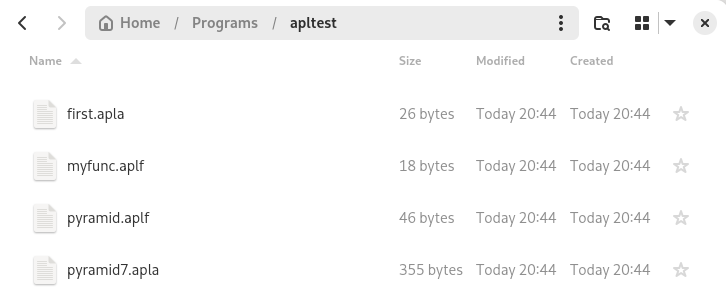
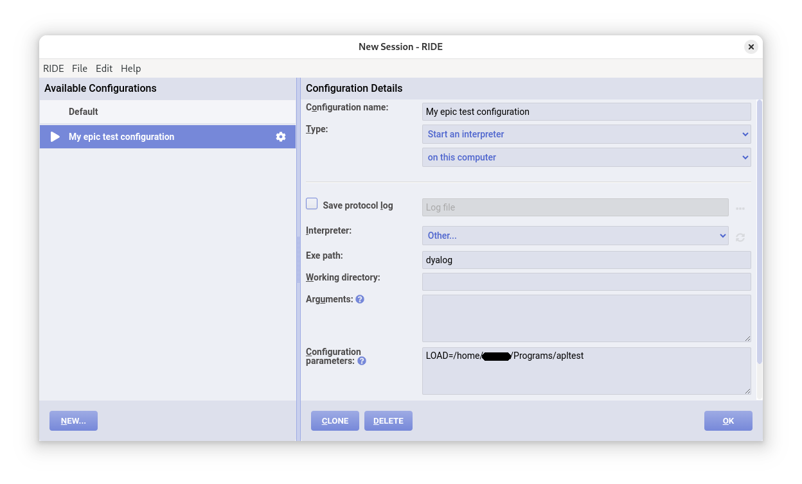

# Development environment

!!! abstract "This part will cover"
    
    - How to use Dyalog RIDE
    - Workspace management
    - Storing your code as text with Dyalog LINK

---

If everything has gone to plan, you should be able to write APL in the editor just like you did on TryAPL before this.
This part is going to go through some tips and tricks and get you familiar with how **real** APL programmers do their thing.

## Typing glyphs

The prefix method of typing glyphs works just as before in RIDE.
Make sure to go to `Edit > Preferences > Keyboard` and change your keyboard layout and prefix key to the right settings.

The tab method doesn't work in RIDE, unless you installed a tab completion script as mentioned in [Chapter 1](../ch1/part3.md).
However, the "bug" where you couldn't type certain prefix combinations is fixed as long as you set the right layout.
For example, on TryAPL, if you are using a Finnish keyboard, you can't type the `←` symbol using the prefix method, since <kbd>PREFIX</kbd> <kbd>[</kbd> does not work.
But in RIDE, the prefix is changed to <kbd>PREFIX</kbd> <kbd>å</kbd>, which works natively on your keyboard!
As before, you can hover over the buttons at the top to see the right key combination (and you can just click to insert the symbol).

## Workspaces

The biggest benefit of using RIDE is that you can save and load your code.
Imagine if you couldn't do this for bigger projects!

Dyalog stores APL code in _APL workspaces_.
These are binary blobs of data containing all of your code, variables, values, and command history.
Don't worry: we'll cover a way to save your code as plaintext later on.

Let's say you're just done with an intense APL coding session:

```apl
      pyramid ← {⍵-∘.⌈⍨|⍵-⍳¯1+⍵×2}
      pyramid
     ∇pyramid←{⍵-∘.⌈⍨|⍵-⍳¯1+⍵×2}
     ∇
      pyramid 5
1 1 1 1 1 1 1 1 1
1 2 2 2 2 2 2 2 1
1 2 3 3 3 3 3 2 1
1 2 3 4 4 4 3 2 1
1 2 3 4 5 4 3 2 1
1 2 3 4 4 4 3 2 1
1 2 3 3 3 3 3 2 1
1 2 2 2 2 2 2 2 1
1 1 1 1 1 1 1 1 1
      pyramid 3
1 1 1 1 1
1 2 2 2 1
1 2 3 2 1
1 2 2 2 1
1 1 1 1 1
      pyramid7 ← pyramid 7
      first ← pyramid7[1;]
      first
1 1 1 1 1 1 1 1 1 1 1 1 1

      myfunc ← {4/⍵}
      myfunc 'meow'
mmmmeeeeoooowwww
```

Then, to save this as a workspace, you can use the `)save filename` command, replacing `filename` with the name of your project:

```apl
      )save test
test.dws ⍝ saved Tue Jan 28 20:03:04 2025
```

!!! warning "***Remember to save your workspaces***"

    Sometimes, before exiting your session, RIDE will suggest to save your workspace; however, always ***remember to save your workspaces***

Once you close and re-open RIDE, you can load your workspace by using the `)load filename` command:

```apl
      )load test
./test.dws ⍝ saved Tue Jan 28 20:03:04 2025
```

!!! tip "System commands"

    The APL developers had to find a way to include useful commands in a way that they can't be confused for APL functions.
    The solution: no APL expression starts with a closing bracket, so let's use those for commands!

    To see a full list of system commands, go to <https://aplwiki.com/wiki/System_command>.

There are some other useful system commands: `)fns` lists all functions, `)vars` lists all variables, `)erase` deletes a function or variable, `)clear` deletes everything, and `)off` closes RIDE.

```apl
      )fns
myfunc  pyramid 
      )vars
first   pyramid7        
      )erase first
      )vars
pyramid7        
      )erase myfunc
      )fns
pyramid 
      )clear
clear ws
      )vars
      )fns
```

## Saving your code as text

For many years, APL programmers relied on workspaces to write their APL code.
If they needed to send code to a friend or coworker, they would just email the workspace file to them!


To us modern programmers, this is completely crazy, but some older APL programmers still swear by workspaces.
The developers of APL eventually realised that workspaces on their own were a terrible idea: you couldn't use version control (for example, git), you couldn't manage projects with more than one person, and making small changes to any code required you to load the whole binary workspace blob with all of the variables and other history included.


To fix this, they created a _user command_ called LINK!

!!! tip "User commands"

    System commands are functions that let you interact directly with the system.
    They are actually written in C under the hood.
    On the other hand, _user commands_ are written in APL and let you do more involved actions.
    You can also overwrite or modify them if you're crazy enough.

    All user commands start with a `]`, for the same reason that system commands start with a `)`.

    To see a full list of user commands, run the _help_ command `]?`:

    ```apl
          ]?
    ───────────────────────────────────────────────────────────────────────────────
                                                                                
    104 commands:                                                                  
                                                                                
    ARRAY         Compare  Edit                                                   
    CALC          Factors  FromHex  PivotTable  ToHex                             
    DEVOPS        DBuild  DTest  GetTools4CITA                                    
    EXPERIMENTAL  Get                                                             
    FILE          CD  Collect  Compare  Edit  Find  Open  Replace  Split          
                ToLarge  ToQuadTS  Touch                                        
    FN            Align  Calls  Compare  Defs  DInput  Latest  ReorderLocals      
    LINK          Add  Break  Configure  Create  Export  Expunge  GetFileName     
                GetItemName  Import  Refresh  Resync  Status  Stop  Trace       
    NS            ScriptUpdate  Summary  Xref                                     
    OUTPUT        Box  Boxing  Disp  Display  Find  Format  HTML  LastResult      
                Layout  Plot  Repr  Rows  View                                  
    PERFORMANCE   Profile  RunTime  SpaceNeeded                                   
    SALT          Boot  Clean  Compare  List  Load  Refresh  RemoveVersions       
                Save  Set  Settings  Snap                                       
    TOOLS         Activate  ADoc  APLCart  Calendar  Config  Deactivate  Demo     
                Help  Version                                                   
    TRANSFER      In  Out                                                         
    UCMD          UDebug  ULoad  UMonitor  UNew  UReset  USetup  UVersion         
    WS            Check  Compare  Document  FindRefs  FnsLike  Locate  Map        
                Names  NamesLike  Nms  ObsLike  Peek  SizeOf  VarsLike          
                                                                                
    ]            ⍝ for general user command help                                   
    ] -??        ⍝ for brief info on each command                                  
    ]grp -?      ⍝ for info on the "GRP" group                                     
    ]grp.cmd -?  ⍝ for info on the "Cmd" command of the "GRP" group
    ```

Let's use the `]LINK` command to create a link between our workspace and a folder.
Let's see how to use it using the help command again:

```apl
      ]LINK -?
                                                                              
 LINK          User commands for namespace-directory synchronisation (see     
               https://dyalog.github.io/link ):                               
  Add          Associate items in linked namespaces with new files/directories
               in corresponding directory, optionally with simultaneous       
               definition                                                     
  Break        Break link between namespace and corresponding directory       
  Configure    Set directory or user configuration options                    
  Create       Link a namespace with a directory (create one but not both if  
               non-existent)                                                  
  Export       Export a namespace to a directory (create the directory if     
               absent); does not create a link                                
  Expunge      Erase item and associated file                                 
  GetFileName  Return name of file associated with item                       
  GetItemName  Return name of item associated with file                       
  Import       Import a namespace from a directory (create the namespace if   
               absent); does not create a link                                
  Refresh      Manually synchronise namespace or directory contents           
  Resync       Automatically synchronise namespace-directory differences      
  Status       List active namespace-directory links                          
  Stop         Set, clear or report on breakpoints                            
  Trace        Set, clear or report on lines traced                           
                                                                              
]            ⍝ for general user command help                                  
]grp -?      ⍝ for info on the "GRP" group                                    
]grp.cmd -?  ⍝ for info on the "Cmd" command of the "GRP" group
```

And again for the `Create` subcommand:

```apl
      ]LINK.Create -?
───────────────────────────────────────────────────────────────────────────────
                                                                               
]LINK.Create                                                                   
                                                                               
Link a namespace with a directory (create one but not both if non-existent)    
    ]LINK.Create [<ns>] <dir> [-source={ns|dir|auto}]                          
    [-watch={none|ns|dir|both}] [-casecode] [-forceextensions]                 
    [-forcefilenames] [-arrays{=name1,name2,...}] [-sysvars] [-flatten]        
    [-beforeread=<fn>] [-beforewrite=<fn>] [-getfilename=<fn>]                 
    [-codeextensions=<var>] [-typeextensions=<var>] [-fastload] [-ignoreconfig]
    [-text={aplan|plain}]                                                      
                                                                               
]LINK.Create -??  ⍝ for argument and modifier details                          
]FILE.Open https://dyalog.github.io/link/4.0/API/Link.Create
```

Ok, enough documentation. Time to create the link!


`]LINK.Create` takes two arguments: the _namespace_ you are using and the path on your computer you want to link the workspace to.
In most cases, you should just put `#` for the namespace, which just means "everything". `#` is the root namespace, the workspace itself.
Namespaces are a way to organise code within one workspace, more on namespaces in section 7.7.


All you have to do now is to create a new (empty) folder somewhere on your computer, and pass its path to the link command.
For example, I have created a new folder called `apltest` in the `Programs` folder, so I'll run this:

```apl
      ]LINK.Create # Programs/apltest
Linked: # ←→ ~/Programs/apltest
```

The bi-directional arrow means changes to our code in our namespace `#` are written to our folder, and changes to our code in the folder are reflected back to our namespace! On some systems, only a uni-directional arrow is shown. If this is the case, you might need to install the [.NET Framework](https://dotnet.microsoft.com/en-us/download) from Microsoft, but a uni-directional link is sufficient for our purposes.

Let's see what happens when we create the same functions and variables as in the previous example.

```apl
      pyramid ← {⍵-∘.⌈⍨|⍵-⍳¯1+⍵×2}
      pyramid7 ← pyramid 7
      first ← pyramid7[1;]
      myfunc ← {4/⍵}
```

Nothing special happens for now.
This is because LINK only cares about automatically saving "real" functions, which we'll get to in the next part.
For now, though, we can manually add our dfns and variables to the link:

```apl
      ]LINK.Add myfunc
Added: #.myfunc
      ]LINK.Add pyramid
Added: #.pyramid
      ]LINK.Add pyramid7
Added: #.pyramid7
      ]LINK.Add first
Added: #.first
```

Open the folder you created, and voilà: your code has been saved!



!!! info "Filetypes"

    LINK will save your code using different extensions depending on the type:

    - `.aplf` for functions
    - `.apla` for arrays
    - `.apln` for namespaces

Now, you no longer have to use the `)save` or `)load` command to store workspaces: all you have to do is use LINK!
Actually, if you're using LINK, don't use the `)save` and `)load` commands. Strange things will happen if you do...

## Loading your code from a linked folder

Let's say you've closed and re-opened RIDE again.
How do you get back your saved code?
There are two options: the first is clunky and manual, and the second is smooth and automatic.

### The clunky and manual option

This is pretty straightforward: just run the `]LINK` command again.

```apl
      )fns
      )vars

      ]LINK.Create # Programs/apltest
Linked: # → ~/Programs/apltest

      )fns
myfunc  pyramid 
      )vars
first   pyramid7
```

LINK will just load all of the files stored in your folder and put them back in your fresh workspace.
The only problem is that you'll have to run this command every time you re-open RIDE, which might get a little annoying.

### The smooth and automatic version

It's time to put the little pop-up menu that opens every time you boot RIDE to good use.
Close and re-open RIDE or (if that doesn't work) click on `File > New Session` in the top-left corner.
Then, click on `New...`, choose a name, and change `Connect to an interpreter` to `Start an interpreter`.
After this you should be able to see a text box that says `Exe path` and `Configuration parameters`.

- Put `dyalog` under `Exe path`
- Put `LOAD=your_path_here` under `Configuration parameters`
    - The path must be the full path or RIDE won't recognise it
    - For example, on Linux, my path is `/home/username/Programs/apltest`
    - On Windows, this could be `C:\Users\username\Programs\apltest`

If you did everything correctly, the screen should look something like this:



Press the "Run" triangle and the link should load automatically!

!!! bug "Scary red text"

    Don't worry if RIDE tells you `VALUE ERROR: Undefined name: Run` in scary red text.
    Every time the automatic link system executes, it tries to run a function called `Run` if you've created one.
    If you haven't, nothing bad will happen, but you will see this red text.
