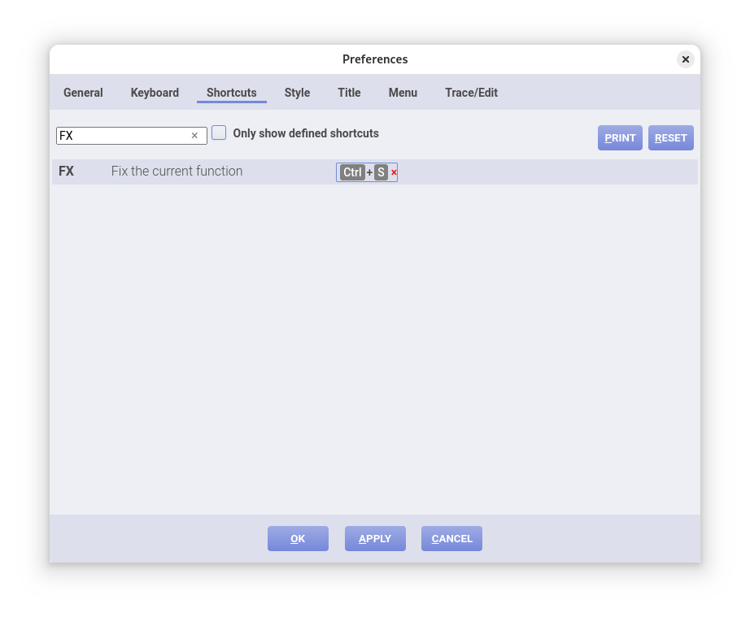
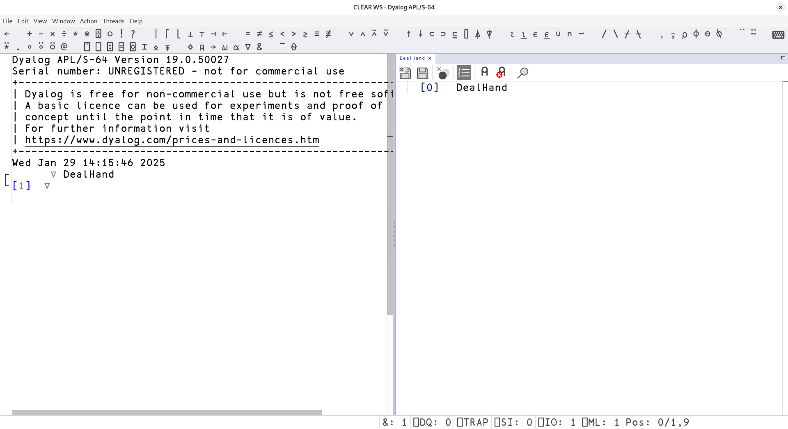
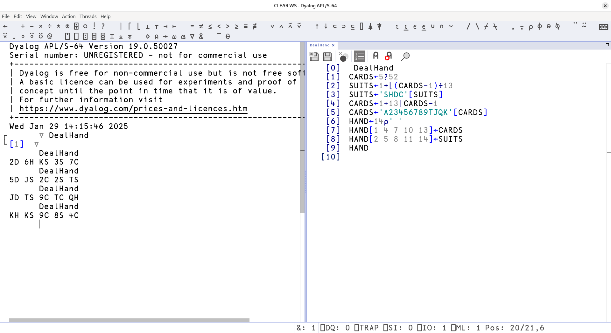
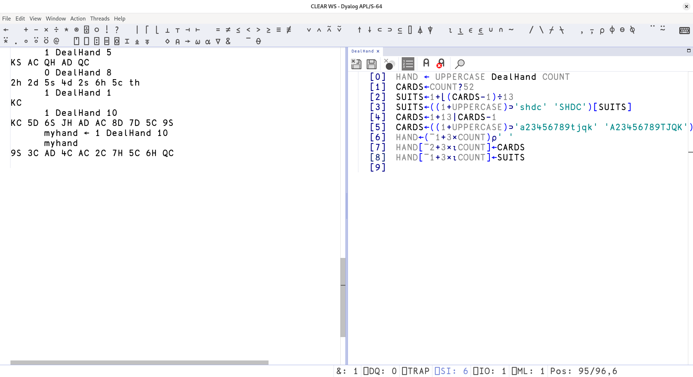
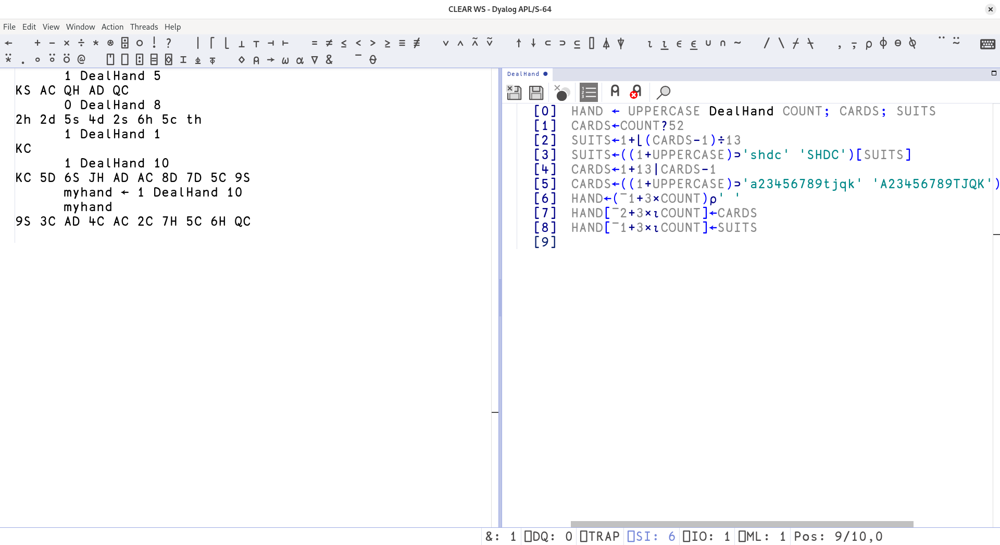

# Traditional functions

!!! abstract "This part will cover"
    
    - Tradfns
    - If statements
    - Branch

---

## One more bit of setup

Before moving on, let's add a quick shortcut that will help us very soon: saving with Ctrl+S.

Go into `Edit > Preferences > Shortcuts` and search `FX` in the search bar.
Then, set the "Fix the current function" option to <kbd>Ctrl</kbd> <kbd>S</kbd>.
It should look a little something like this:



## Tradfns

Finally, we can get to the actual programming part ;D

Imagine for a second that you've been programming for a long time, and came up with this code that'll simulate dealing a hand from a pack of cards:

```apl
      CARDS←5?52
      SUITS←1+⌊(CARDS-1)÷13
      SUITS←'SHDC'[SUITS]
      CARDS←1+13|CARDS-1
      CARDS←'A23456789TJQK'[CARDS]
      HAND←14⍴' '
      HAND[1 4 7 10 13]←CARDS
      HAND[2 5 8 11 14]←SUITS
      HAND
2D AS 7D 5D AH
```

Now, this is cool, but running this again is annoying (I don't really want to copy-paste all of the code every time I want a new hand).

Tradfns - pronounced exactly like you'd expect - are a way to write longer and more involved functions in APL.
You'll finally be able to write program logic that spans multiple lines instead of having to cram everything into one line!

!!! note "Typing the Del operator `∇`"

    Prefix method: <kbd>PREFIX</kbd> <kbd>G</kbd>
    
    You can remember this since G stands for Giza and the symbol looks like the pyramid of Giza (but flipped upside-down for whatever reason)

To create a tradfn, we use the Del operator `∇` followed by the name of the function we want to create.
RIDE will then go into a function writing mode: it will spit out a line number `[1]` and ask you to write the first line of your function.
If you press enter, it will move on to line number `[2]` etc.
Now, we could write all of our functions this way, but we'll do something a little more clever.
Instead of writing any code, let's just end the function (and leave it empty) by typing `∇` again:

```apl
      ∇ DealHand
[1]  ∇
```

Now, for the interesting part: we can double-click the text `DealHand` in the editor to open the function in a separate tab for editing!



Now, let's paste our card-dealing code in the editor, and save with <kbd>Ctrl</kbd> <kbd>S</kbd>.
Then, we can run the function by typing its name in the left-hand pane.



!!! tip "Software development flow"

    When developing larger programs in APL, always use functions for storing code.
    For example: you can have a tradfn called `Main` that has your main program logic, and which calls other tradfns that actually implement your code.

    This way, all of your code will be stored in the workspace and work nicely with LINK.
    If you have LINK set up, all tradfns will be stored automatically.
    Remember that dfns and variables are not stored automatically in LINK: if they are outside a tradfn, they are considered to be for "testing purposes" and not a part of your actual code.

## Parameters and return values

Okay, that's great, but now our functions are just names for chunks of code.
This is good for our main function but not so ideal if we actually wanna calculate and compute stuff.
We can make them more useful by letting them take parameters and return values!

We can convert our card dealing function to take in how many cards we want to deal
Here's the code that lets you change the number of cards based on the variable `COUNT`
and whether it uses uppercase or lowercase letters using the variable `UPPERCASE` (bonus points if you can see how it works):

```apl
COUNT←5
UPPERCASE←1
CARDS←COUNT?52
SUITS←1+⌊(CARDS-1)÷13
SUITS←((1+UPPERCASE)⊃'shdc' 'SHDC')[SUITS]
CARDS←1+13|CARDS-1
CARDS←((1+UPPERCASE)⊃'a23456789tjqk' 'A23456789TJQK')[CARDS]
HAND←(¯1+3×COUNT)⍴' '
HAND[¯2+3×⍳COUNT]←CARDS
HAND[¯1+3×⍳COUNT]←SUITS
```

Now, obviously, we don't want to adjust the two variables manually: let's make them parameters of our `DealHand` function.

In APL, the 0th line of a function is called the _header line_.
Here, you can specify your program's paramters and what variable it returns after exiting.
The syntax is the same as when you run a function: a function `FUNC` that takes in a left argument `LEFT`, right argument `RIGHT`, and returns a result `RESULT` will have the header line `RESULT ← LEFT FUNC RIGHT`. We can also make the left argument optional by surrounding it with `{LEFT}` curly braces.

Here's what it looks like for our code:


If you have sharp eyes, you'll see that some of the variables in our function are grey and some are black.
What's up with that?

When writing a tradfn, any variables you include in the header line will be local variables (grey) and anything else will be global variables (black).
What does this mean? Local variables are erased when the function exits, while global variables get stored in your workspace.
When writing code, you **almost always want your variables to be local**.
To do this, we can put them in the header line using semicolons after our function definition.
This is how it should ideally look like:



!!! warning "Local vs global variables"

    If you have any black-coloured variables in your code, you should make them grey by including them in the header line.
    If you don't do this, you risk filling up your workspace with garbage: global variables stay in your workspace even after running your function, and will hang around until you delete them manually.

    Unless you are using a tradfn to define some global variables that you need in the editor, you should make them local!

## Conditional expressions

Recall that when using dfns we could execute parts of our code depending on whether a logical operation returns a `1` or a `0`. In tradfns, the usual dfn conditional expressions are not recognized. The equivalent method of specifying a conditional expressions is similar to imperative programming languages, using an ``:If`` statement.

Consider the following example, where we check if our tradfn has a left argument using the [`⎕NC` function](https://help.dyalog.com/17.1/Content/Language/System%20Functions/nc.htm) which returns `0` when a variable name is unused.

```apl
       ∇ result ← {LEFT} function RIGHT
         :If 0=⎕NC'LEFT'
              result ← 'No left argument specified'
         :Else
              result ← 'The left argument is ',LEFT
         :EndIf
       ∇

       function 'world'
No left argument specified

       'hello' function 'world'
The left argument is hello
```

The `:If` keyword is followed by a conditional expression, here `0=⎕NC'LEFT'`, and executes the code that follows if the conditional expression returns a value of `1` (true). If the value is `0` (false), then it executes the code after an `:Else` statement if it exists.

These types of control structures are discouraged in APL code since they are usually the wrong tool for the job; however, they are common when interfacing with external code or libraries. We will not cover any further control flow structures, such as `:For`, `:While`, or `:Repeat`, one reason for which is that they have the same syntax as in imperative programming languages.

## Branch

In many older APL programs, you may see the branch `→` symbol. Its behavior is similar to `goto` and is similarly discouraged, with some dialects dropping it entirely. When given a right argument in functions, it continues the execution of code from that line onwards. If the line number does not exist (including 0) or when it is not given a right argument at all, the code halts execution.

Instead of hard-coding line numbers which change as our code grows, *labels* may also be used. The syntax is the name of the label followed by a colon `:`. This simply assigns the line number to the name of the label. To verify this, see the following example.

```apl
       ∇ labeltest
              → third

              first:
              'hello'

              second:
              'world'

              third:
              ⎕ ← first second third
       ∇

       labeltest
2 4 6
```


See the following example that sets the display precision of numbers to either `1` significant figure, `7` significant figures, or `14` significant figures depending on its right argument.

```apl
       ∇ precision type
              → (NDP FDP DDP)['SINGLE' 'FLOAT' 'DOUBLE'⍳⊂type]

              NDP:
              ⎕PP ← 1
              →

              FDP:
              ⎕PP ← 7
              →

              DDP:
              ⎕PP ← 14

       ∇

       precision 'SINGLE'
       2÷3
0.7
       precision 'FLOAT'
       2÷3
0.6666667

       precision 'DOUBLE'
       2÷3
0.66666666666667
```

These kinds of expressions are used very frequently in older APL code, the kind which you might see in APL programming books such as [Mathematical experiments on the computer](https://archive.org/details/mathematicalexpe0000gren/).


