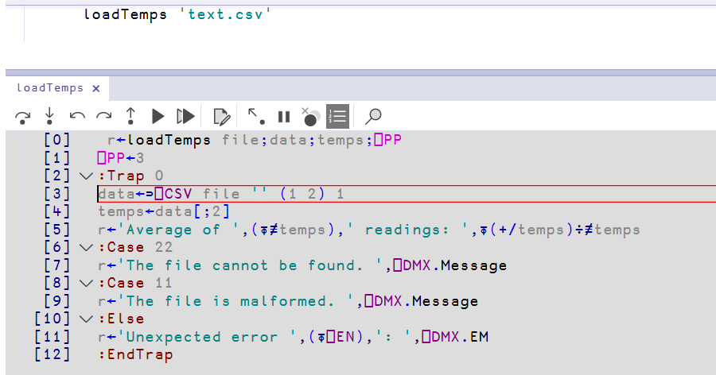
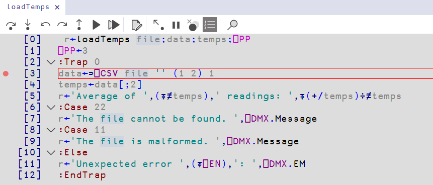

# Error handling

!!! abstract "This part will cover"
    
    - Error traps
    - Function tracing

---

Dyalog APL provides many different types of error handling, we present some of them in this section.

## Error traps

Programs often need to make use of external data, which is predictably unpredictable. Traps can laid which execute when this expected unpredictability leads to an error, allowing it to be gracefully dealt with.

Users of imperative programming languages will recognize the following ``:Trap`` control structure as the familiar ``try`` control structure.
```apl
      ∇ result ← a DIVIDE b
      :Trap 11
            a÷b
      :Else
            'How dare you, division by zero is not allowed!'
      :EndTrap
      ∇

      1 DIVIDE 1
1
      0 DIVIDE 0
1
      1 DIVIDE 0
 How dare you, division by zero is not allowed!
```

The ``:Trap`` control structure takes as argument a numerical error code signifying the error to guard against. A full list of arguments is available at the [Dyalog APL documentation site](https://help.dyalog.com/20.0/Content/Language/System%20Functions/trap.htm) but the most important values are as follows:

| Code | Error |
|:----:|-------|
| `0`  | Any error |
| `1`  | `WS FULL` |
| `2`  | `SYNTAX ERROR` |
| `3`  | `INDEX ERROR` |
| `4`  | `RANK ERROR` |
| `5`  | `LENGTH ERROR` |
| `6`  | `VALUE ERROR` |
| `7`  | `FORMAT ERROR` |
| `10` | `LIMIT ERROR` |
| `11` | `DOMAIN ERROR` |
| `22` | `FILE NAME ERROR` |

Multiple errors can be caught by passing a vector of error codes to the ``:Trap`` control structure and using ``:Case`` to differentiate them, with extra diagnostic information (such as the error message) provided by the [``⎕DMX`` system object](https://docs.dyalog.com/20.0/language-reference-guide/system-functions/dmx/). The full list of properties is listed therein.

Consider the following example of a tradfn averaging weather measurements from a given file of comma-separated values, using the ``⎕CSV`` system function which will be covered in [section 7.6](part6.md).

```apl
      ∇ r←loadTemps file;data;temps;⎕PP
      ⎕PP ← 3
      :Trap 0
            data←⊃⎕CSV file '' (1 2) 1
            temps←data[;2]
            r←'Average of ',(⍕≢temps),' readings: ',⍕(+/temps)÷≢temps
      :Case 22
            r←'The file cannot be found. ',⎕DMX.Message
      :Case 11
            r←'The file is malformed. ',⎕DMX.Message
      :Else
            r←'Unexpected error ',(⍕⎕EN),': ',⎕DMX.EM
      :EndTrap
      ∇
```

The following three files are loaded in the current working directory (which can be obtained by the change directory ``]cd`` system command), the first of which should be the ideal case, and the other two are incorrectly formatted.

```
good.csv          text.csv          short.csv
station,temp      station,temp      station,temp
Kumpula,4.2       Kumpula,4.2       Kumpula,4.2
Malmi,3.8         Malmi,n/a         Malmi
Vantaa,5.1        Vantaa,5.1        Vantaa,5.1
```

The function gives the following results.

```
      loadTemps 'good.csv'
Average of 3 readings: 4.37
      loadTemps 'text.csv'
The file is malformed. Non-numeric data in record 3, field 2 (⎕IO=1)
      loadTemps 'short.csv'
The file is malformed. Invalid number of fields in record 3 (⎕IO=1)
      loadTemps 'weather.csv'
The file cannot be found. weather.csv: Unable to open file
      loadTemps '/tmp/'
Unexpected error 19: FILE ACCESS ERROR
```

## Function tracing

Traps can only capture expected errors, and handle them in pre-determined ways. For unexpected errors, typically found during development or in production, and when the program is too large to hold the entire state mentally, it is more useful to have interactive execution to investigate the state at which an error occured. Tracing through the functions at the error line-by-line is a natural method of doing so.

### The Tracer

The tracer can be manually invoked for any expression by hitting ++ctrl+enter++ instead of ++enter++ to evaluate an expression.

The Tracer shows the source code of the function and marks the line that runs next. In the picture below, the mark is on line ``[3]``, because ++ctrl+enter++ was pressed three times.



The buttons on the toolbar, from left to right, take the following actions.

| Button | What it does | Key |
|---|---|---|
| Exec | Runs the marked line | ++enter++ |
| Trace | Runs and traces the function on the marked line | ++ctrl+enter++ |
| Back | Moves the mark back one line | |
| Skip | Moves the mark forwards one line without running it | |
| Continue | Runs until the calling function gets control again | |
| Restart | Leaves the Tracer and runs the rest of the function as normal | |
| Restart all | Does the same for every thread | |
| Edit | Opens the marked name in the editor | ++shift+enter++ |
| Exit | Stops the function and leaves the Tracer | ++escape++ |
| Interrupt | Stops a function that runs for too long | |
| Reset | Removes the trace, stop and monitor marks from this function | |

The last two buttons show the line numbers and search the source.

Dyalog also opens the Tracer without invocation when a function stops because of an error, the `Trace on error` option controls this.

### Breakpoints

A breakpoint invokes the tracer at a specific line during execution. The easiest way to add a breakpoint is in either the function definition or the tracer. Click the left margin of the tracer or function definition, beside the line number. Click the same place again to remove it. A breakpoint shows as a red circle in that margin.



Alternatively, you can use the ``⎕STOP`` system function to set (and unset) a breakpoint at a particular line.

```apl
      2 ⎕STOP 'loadTemps'
2
      ⎕STOP 'loadTemps'
2
      ⍬ ⎕STOP 'loadTemps'
```

The first line sets a breakpoint on line 2. The third line asks which lines have breakpoints. The fifth line removes all of them.

### Automatic output

The ``⎕TRACE`` system function prints the result of each chosen line to the session. This is most useful for a line that runs many times, like the following fibonacci function.

```apl
      ∇ r←fib n;a;b;i
      a←0 ⋄ b←1
      :For i :In ⍳n
            (a b)←b(a+b)
      :EndFor
      r←a
      ∇

      fib 8
21
      3 ⎕TRACE 'fib'
      fib 8
 fib[3]  1 1 
 fib[3]  1 2 
 fib[3]  2 3 
 fib[3]  3 5 
 fib[3]  5 8 
 fib[3]  8 13 
 fib[3]  13 21 
 fib[3]  21 34 
21
      ⍬ ⎕TRACE 'fib'
```

Each traced line prints the name of the function, the line number, and the result.