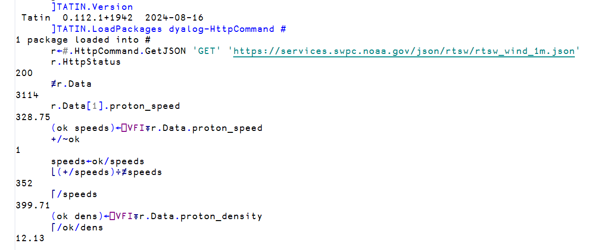

# External libraries

!!! abstract "This part will cover"
    
    - The Tatin package manager
    - Activating Tatin
    - Loading and using a package

---

So far, every function in this course has been either part of Dyalog APL or a user-defined function. This is a perfectly fine paradigm for APL, where functions are so short that they can be printed onto [physical](https://github.com/EvansWinner/List-of-array-language-math-books) [books](https://archive.org/details/mathematicalexpe0000gren/) for you to copy, in the same way that a mathematics textbook might print a formula that you can enter into your calculator.

> [...] the advantages of executability and universality found in programming languages can be effectively combined, in a single coherent language, with the advantages offered by mathematical notation.
>
> [_Notation as a Tool of Thought_](https://dl.acm.org/doi/pdf/10.1145/1283920.1283935), Ken Iverson

APL programmers have a habit of memorizing their favorite functions in the form of so-called _idioms_. The Finnish APL Association collected over 700 of them in the [FinnAPL Idiom Library](https://archive.org/details/finn-apl-idiom-list) in the 1980s, small enough to publish as a pocket edition, and [APLcart](https://aplcart.info/) is the modern version with nearly 4000 entries.

Certain use-cases require more direct communication with the operating system, such as for networking, which would be much easier to treat as a black-box. Certain external packages might also have useful functions that don't have a concise idiomatic form, typically dealing with external data.

Other languages solve this with a package manager, like `pip` for Python or `npm` for JavaScript. APL has [Tatin](https://tatin.dev), and it's built into Dyalog since version 19.0.

## Activating Tatin

Tatin comes with Dyalog APL, and can be activated using the ``]Activate`` system command. 

```apl
      ]Activate tatin
Rebuilding user command cache... done
Restart APL to complete activation.
cmddir set to: C:/Users/username/Documents//MyUCMDs;...
```

This copies Tatin from the Dyalog installation folder into your own user folder, and tells the user command system where to find it.

!!! bug "Invalid user command"

    If you've restarted RIDE and tried a Tatin command, you may have come across the following error.

    ```apl
          ]TATIN.Version
    * Invalid user command; to see a list of all user commands type
          ] -?
    ```

    This is because RIDE keeps a cached list of user commands, and running ``]UReset`` will resolve the issue.

    ```apl
          ]UReset
    144 commands reloaded
    ```

You can check that everything worked by running ``]TATIN.Version``.

```apl
      ]TATIN.Version
 Tatin  0.112.1+1942  2024-08-16
```

## Registries and packages

Tatin gets its packages from online registries, and the default `tatin.dev` registry is maintained by Dyalog.

```apl
      ]TATIN.ListRegistries
 Alias       URL                       ID                                    Port  Priority
 ----------  ------------------------  ------------------------------------  ----  --------
 tatin       https://tatin.dev/        3a252259-1554-4d09-8381-8ac9aded64cf     0       100
 tatin-test  https://test.tatin.dev/   ba053b97-a68a-4f90-abc4-e98cff187472     0         0
```

At the time of writing there are 72 packages on the official `tatin.dev` repository.

```apl
      ]TATIN.ListPackages -group=dyalog
Registry: https://tatin.dev                ≢ 7
 Group & Name                   # major versions
 ------------                   ----------------
 dyalog-APLProcess                             1
 dyalog-HttpCommand                            1
 dyalog-Jarvis                                 1
 dyalog-NuGet                                  1
 dyalog-OpenAI                                 1
```

Every package has a group and a name, and you refer to it as `group-name`. The group is the name of the publisher, so `dyalog-HttpCommand` is the official `HttpCommand` package published by Dyalog.

## Loading a package

The simulation in the [previous section](part5.md) produced summaries of a simulated solar wind. Real solar wind measurements can be obtained via satellite measurements, and some are published through the [NOAA website](https://services.swpc.noaa.gov/) as JSON every minute. There is an official HTTP networking package `dyalog-HttpCommand` from Dyalog, which we will use to retrieve this information.

```apl
      ]TATIN.LoadPackages dyalog-HttpCommand #
1 package loaded into #
```

Tatin downloads the package, checks whether it depends on any other packages, and places it all into `#`. (More on namespaces in the next section).

```apl
      #.HttpCommand.Version
 HttpCommand  5.11.1  2026-05-18
      #.HttpCommand.⎕NL ¯3
 Base64Decode  Base64Encode  Chunk  Do  Documentation  Fix  Get  GetEnv  GetJSON  New  ...
```

The `Get` function fetches a page and returns its raw text, and the `GetJSON` function additionally converts JSON into APL arrays and namespaces.

```apl
      r←#.HttpCommand.GetJSON 'GET' 'https://services.swpc.noaa.gov/json/rtsw/rtsw_wind_1m.json'
      r.HttpStatus
200
      ≢r.Data
3114
      r.Data[1].proton_speed
328.75
```

`HttpStatus` is the standard HTTP status code, where `200` denotes success, and `Data` contains the parsed JSON; here a vector of 3114 namespaces, one per minute of measurement, where `proton_speed` is the speed of the solar wind in km/s.

`r.Data.proton_speed` gives the vector of proton speeds, but computing on it directly is not possible since the feed writes the text `null` for the minutes where the instrument has no reading. The verify fix input `⎕VFI` system function can remedy this; it takes in a character vector and returns a boolean vector denoting where the valid numbers are, along with the numerical values themselves.

```apl
      (ok speeds)←⎕VFI⍕r.Data.proton_speed
      +/~ok
1
      speeds←ok/speeds
```

The format `⍕` flattens the vector into a single character vector for `⎕VFI` to parse, and compressing by `ok` keeps the valid readings; exactly one measurement in this fetch was a `null`.

```apl
      ⌊(+/speeds)÷≢speeds
352
      ⌈/speeds
399.71
      (ok dens)←⎕VFI⍕r.Data.proton_density
      ⌈/ok/dens
12.13
```

This gives us an average solar wind speed of 352 km/s over the last two days, a maximum speed of around 400 km/s, and a peak proton density of 12.13 particles per cubic centimetre. 



!!! note "Packages in workspaces"

    The ``]TATIN.LoadPackages`` command only places the package in the current workspace. If the workspace is not saved, the package is gone when the session ends, exactly like any other variable or function.

Loading packages by hand is sufficient for many uses, but for a collaborative project, the packages should be loaded automatically every time the project is opened and their versions specified in the workspace itself. This is the topic of the next section, [Project management](part7.md).
