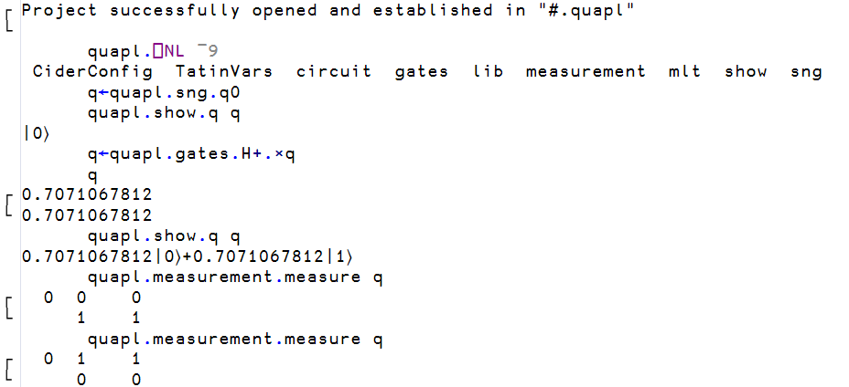

# Project management

!!! abstract "This part will cover"
    
    - Namespaces
    - APL project management using Cider

---

## Namespaces

Object-oriented programming is one of the most popular programming paradigms of all time, and while we will not cover the whole of what Dyalog APL has to offer in terms of objects, an understanding of namespaces is important for understanding how to manage projects.

The previous section placed `HttpCommand` into `#`. `#` is called the root namespace, the namespace where functions and variables will reside in by default. A namespace is a container for names; every workspace has the root namespace `#`, and further namespaces can be created inside it and inside each other, forming a tree.

A namespace is created with the `⎕NS` system function, and names inside it are accessed with dot notation. The right argument of `⎕NS` is a vector of names of functions and variables to be added to this namespace, and the left argument is the name of the namespace (if it doesn't already exist, it is created).

```apl
      step ← 1E¯3
      'config'⎕NS 'step'
      config.retries←3
      config.retries
3
      config.step
0.001
```

`#.HttpCommand.Get` is the function `Get` inside the namespace `HttpCommand` inside the root, and `r.Data` was a namespace produced by `GetJSON`. A namespace can also be written as an APL `.apln` source file, using `:Namespace` and `:EndNamespace`, and stored as a text file; this is the form that packages and projects use for their source.

## From workspaces to projects

[Section 7.2](part2.md) stored code as text with LINK, and [section 7.6](part6.md) loaded packages with Tatin. An APL project puts this arrangement into a folder; the source files, together with a configuration file that records where the source lives, which packages it depends on, and how the workspace should be set up. [Cider](https://github.com/aplteam/Cider) is the project manager that reads this file and performs the setup.

Cider is activated in the same way as Tatin, using ``]Activate``.

```apl
      ]Activate cider
Restart APL to complete activation.
cmddir set to: C:/Users/username/Documents//MyUCMDs;...
```

As with Tatin, the user command cache may need a ``]UReset`` after restarting.

```apl
      ]CIDER.Version
0.42.2+671
```

## Opening a project

[quAPL](https://github.com/nunezco2/quAPL) is a quantum computing simulator written in APL, [presented at the Dyalog '23 conference](https://www.dyalog.com/uploads/conference/dyalog23/materials/U08_quAPLAQuantumComputingLibraryInAPL.pdf), and it is developed as a Cider project. 

Since quantum mechanics was also historically called matrix mechanics, it would seem natural that APL, that treats arrays as first-class objects, would be a natural programming language for running these computations. First clone the repository with `git clone https://github.com/nunezco2/quAPL`. Then open the project by pointing ``]CIDER.OpenProject`` at the folder.

```apl
      ]CIDER.OpenProject C:/Users/username/quAPL -alias=quapl
forceFilenames= 1
Link parameter "watch" is <ns>
The current directory is now C:\Users\username\quAPL
  No Dropbox conflicts found
Project successfully opened and established in "#.quapl"
```

Cider read the configuration file, linked the source folder into a new namespace `#.quapl`, changed the working directory, and also installs any Tatin packages the project depends on. The `-alias=quapl` names the project, so that it can be reopened later with ``]CIDER.OpenProject [quapl]`` without typing the path again. Cider also inspects the project's git repository when one is present, and opens an edit window containing a status report.

The project is now a namespace, and its contents can be listed with the name list `⎕NL` system function. Its right argument is a so-called name class, where `2` selects variables, `3` functions, `4` operators and `9` namespaces, and several classes can be given at once. A positive class returns the names as a character matrix, one per row, and a negative class returns them as a vector of character vectors, which is easier to work with. Prefixing `⎕NL` with a namespace lists the contents of that namespace rather than the current one.

```apl
      config.⎕NL 2
retries
      ⎕NL 9
config
      quapl.⎕NL ¯9
 CiderConfig  TatinVars  circuit  gates  lib  measurement  mlt  show  sng
```

The namespaces `circuit`, `gates`, `measurement`, `show`, `sng` and the others each come from one file in the `APLSource` folder of the repository, written in the `:Namespace` script form. `CiderConfig` and `TatinVars` were injected by Cider and hold the configuration the project was opened with.

## The project in use

In quAPL, a qubit is a 2-row matrix of amplitudes, a quantum gate is a matrix, and applying a gate is the inner product from [section 6.2](../ch6/part2.md).

```apl
      q←quapl.sng.q0
      quapl.show.q q
|0⟩
      q←quapl.gates.H+.×q
      q
0.7071067812
0.7071067812
      quapl.show.q q
0.7071067812|0⟩+0.7071067812|1⟩
```

The Hadamard gate `H` has placed the qubit in an equal superposition of its two basis states, and `quapl.measurement.measure` collapses it back to one of them at random, as quantum mechanics demands.



## The structure of a project

The directory structure of quAPL is as follows, and is the general structure of Cider projects.

```
quAPL/
├── APLSource/                one file per namespace
│   ├── circuit.apln
│   ├── gates.apln
│   ├── lib/
│   ├── measurement.apln
│   ├── mlt.apln
│   ├── show.apln
│   ├── sng.apln
│   └── _r_.aplf
├── Tests/                    75 test functions, test_*.aplf
├── packages_dev/             Tatin packages used only during development
│   └── apl-dependencies.txt
├── apl-package.json
└── cider.config
```

`APLSource` holds the APL code.  The `.apln` files are the `:Namespace` scripts that became `quapl.circuit`, `quapl.gates` and so on, and an `.aplf` file holds a single function; these are the same file types that LINK produced in [section 7.2](part2.md), and Cider uses LINK to load them. `Tests` holds one function per test case, and `packages_dev` lists two Tatin packages, a test framework and a logger, that the developers need but a user of quAPL does not.

## The configuration file

The file Cider read is `cider.config` in the root of the repository.

```json
{
  "CIDER": {
    "dependencies": {
      "tatin": ""
    },
    "dependencies_dev": {
      "tatin": ""
    },
    "parent": "#",
    "projectSpace": "quapl",
    "source": "APLSource",
    "tests": "TestCases.RunTests"
  },
  "SYSVARS": {
    "io": 1,
    "ml": 1
  }
}
```

For the sake of demonstrating a more complex configuration file, we look at Cider's own configuration file, since Cider is a Cider project itself.

```json
{
  "CIDER": {
    "cider_version": "0.52.1",
    "dependencies": {
      "tatin": "tatin-packages=Cider"
    },
    "dependencies_dev": {
      "tatin": "tatin-packages_dev=TestCases"
    },
    "distributionFolder": "Dist",
    "init": "Cider.Init",
    "make": "Admin.Make 1",
    "parent": "#",
    "projectSpace": "Cider",
    "project_url": "https://github.com/aplteam/cider",
    "source": "APLSource",
    "tests": "TestCases.RunTests"
  },
  "SYSVARS": {
    "io": 1,
    "ml": 1
  }
}
```

`source` names the folder of APL source files, and `projectSpace` and `parent` name the namespace they are loaded into; in quAPL the folder `APLSource` became `#.quapl`, and in Cider the same folder becomes `#.Cider`.

`dependencies.tatin` names a folder, which is `tatin-dependencies` by default. The Cider project directory looks as follows.

```
Cider/
├── APLSource/
│   ├── Admin/
│   ├── Cider/
│   ├── TestCases/
│   └── ...
├── Tests/
├── tatin-packages/
│   ├── apl-dependencies.txt
│   ├── apl-buildlist.json
│   ├── aplteam-APLGit2-0.28.0/
│   ├── aplteam-APLTreeUtils2-1.4.1/
│   ├── aplteam-CommTools-2.0.2/
│   ├── aplteam-FilesAndDirs-7.1.1/
│   ├── aplteam-GitHubAPIv3-2.1.0/
│   ├── aplteam-OS-4.0.0/
│   ├── aplteam-OS-4.1.0/
│   ├── dyalog-HttpCommand-5.8.0/
│   └── dyalog-NuGet-0.2.6/
├── tatin-packages_dev/
│   ├── apl-dependencies.txt
│   ├── aplteam-Tester2-4.4.0/
│   └── ...
├── apl-package.json
└── cider.config
```

The packages themselves are folders inside `tatin-packages`, each named by group, name and version. The file `apl-dependencies.txt` next to them lists the packages that the project asked for, and this file is how the versions from the [previous section](part6.md) are recorded for collaborators.

```
aplteam-APLTreeUtils2-1.4.1
dyalog-NuGet-0.2.6
aplteam-CommTools-2.0.2
aplteam-APLGit2-0.28.0
aplteam-FilesAndDirs-7.1.1
```

The astute reader might notice that the folder holds more packages than this file lists! This is because Tatin resolves dependencies and records the full set in `apl-buildlist.json`; `dyalog-HttpCommand-5.8.0` is there because one of the five listed packages requires it. 

The `=Cider` after the folder name in the configuration file loads the packages into a child namespace of that name rather than into the project space itself, so that the packages become `#.Cider.Cider.APLGit2`, `#.Cider.Cider.HttpCommand` and so on, and do not mix with the project's own names.

`dependencies_dev.tatin` does the same for packages that are needed only while developing the project and loads its test framework into a child namespace `TestCases`.

`tests` is an expression, relative to the project space, that runs the test cases, and the ``]CIDER.RunTests`` user command executes it. In Cider it names `TestCases.RunTests`, a function in the namespace that the development packages were just loaded into.

The remaining three entries each name something for Cider to run on the project's behalf. `init` names a function that Cider calls as the last step of ``]CIDER.OpenProject``, once the source is linked and the dependencies are loaded; Cider's own is `Cider.Init`.

`make` names an expression that builds a new version of the project, and the ``]CIDER.Make`` user command executes it; Cider's own is `Admin.Make 1`, a function that runs the test suite, packages the project with Tatin, and writes the resulting compressed ZIP file into the folder named by `distributionFolder`, here `Dist`.

`SYSVARS` sets the system variables, so that the project gets the index origin it was written for regardless of the session it is opened in. Both projects set `⎕IO` to 1, and the Cider documentation recommends always setting it explicitly.

## Creating a project

To create your own project, the ``]CIDER.CreateProject`` user command can be used, which turns an empty folder into a project. The namespace that the project will live in must already exist, since Cider only links the folder.

```apl
      'solarwind'⎕NS''
      ]CIDER.CreateProject C:/Users/username/solarwind solarwind -noEdit
Project successfully created; open as well? (Y/n) y
Link parameter "watch" is <both>
The current directory is now C:\Users\username\solarwind
  No Dropbox conflicts found
Project successfully opened and established in "#.solarwind"
```

Cider writes the project files and asks whether to open the project. Without `-noEdit`, Cider also opens the new configuration file in an editor so that it can be adjusted immediately. The folder now looks as follows.

```
solarwind/
├── APLSource/
└── cider.config
```

```json
{
  "CIDER": {
    "cider_version": "0.42.2",
    "dependencies": {
      "nuget": "nuget-dependencies",
      "tatin": "tatin-dependencies"
    },
    "dependencies_dev": {
      "tatin": "tatin-dependencies_dev"
    },
    "distributionFolder": "Dist",
    "init": "",
    "make": "",
    "parent": "#",
    "projectSpace": "solarwind",
    "project_url": "",
    "source": "APLSource",
    "tests": "",
    "version": ""
  },
  "LINK": {},
  "SYSVARS": {
    "io": 1,
    "ml": 1
  },
  "USER": {}
}
```

The template names the dependency folders but does not create them, since the project has no dependencies yet. To give it one, first change the `tatin` entry to `"tatin-dependencies=pkgs"`, so that the packages will be loaded into a child namespace `pkgs`, and then add the package from the previous section with ``]CIDER.AddTatinDependencies``.

```apl
      ]CIDER.AddTatinDependencies dyalog-HttpCommand
solarwind: add dependencies to the folder tatin-dependencies/ (Y/n) y
Would you like to (re-)load all Tatin dependencies? (Y/n) y
 1 Tatin dependency added:
 dyalog-HttpCommand-5.11.1
 1 dependency was loaded
```

```
solarwind/
├── APLSource/
├── tatin-dependencies/
│   ├── apl-buildlist.json
│   ├── apl-dependencies.txt
│   └── dyalog-HttpCommand-5.11.1/
└── cider.config
```

```apl
      solarwind.⎕NL ¯9
 CiderConfig  pkgs 
      solarwind.pkgs.⎕NL ¯9
 HttpCommand 
      solarwind.pkgs.HttpCommand.Version
 HttpCommand  5.11.1  2026-05-18 
```

Anyone who clones this folder and opens it with ``]CIDER.OpenProject`` gets the same package at the same version, which simplifies collaboration on large projects substantially.

We will use the example of the previous section of obtaining and processing solar wind data from the NOAA for our custom project, creating the following two files in our source code editor of choice.

`APLSource/Fetch.aplf`

```apl
 speeds←Fetch;url;r
 url←'https://services.swpc.noaa.gov/json/rtsw/rtsw_wind_1m.json'
 r←pkgs.HttpCommand.GetJSON 'GET' url
 speeds←Stats.Clean r.Data.proton_speed
```

`APLSource/Stats.apln`

```apl
:Namespace Stats

    Clean←{(ok v)←⎕VFI⍕⍵ ⋄ ok/v}

    Mean←{⌊(+/⍵)÷≢⍵}

    Peak←{⌈/⍵}
:EndNamespace
```

A function stored in an `.aplf` file needs no `∇` delimiters, since the file boundary shows where the function begins and ends.

The directory structure is now as follows.

```
solarwind/
├── APLSource/
│   ├── Fetch.aplf
│   └── Stats.apln
├── tatin-dependencies/
│   ├── apl-buildlist.json
│   ├── apl-dependencies.txt
│   └── dyalog-HttpCommand-5.11.1/
└── cider.config
```

Opening the file in Dyalog and testing out the functions we've written, all the expected results are obtained.

```apl
      ]CIDER.OpenProject C:/Users/username/solarwind -alias=solarwind
Link parameter "watch" is <both>
Report availability of later versions of installed Tatin packages? (y/N) n
Tatin installation folder "C:/Users/username/solarwind/tatin-dependencies" exists, therefore no packages loaded
The current directory is now C:\Users\username\solarwind
  No Dropbox conflicts found
Project successfully opened and established in "#.solarwind"
      solarwind.⎕NL ¯9
 CiderConfig  Stats  pkgs 
      solarwind.⎕NL ¯3
 Fetch 
      solarwind.pkgs.⎕NL ¯9
 HttpCommand

      s←solarwind.Fetch
      ≢s
3153
      solarwind.Stats.Mean s
345
      solarwind.Stats.Peak s
399.71
```